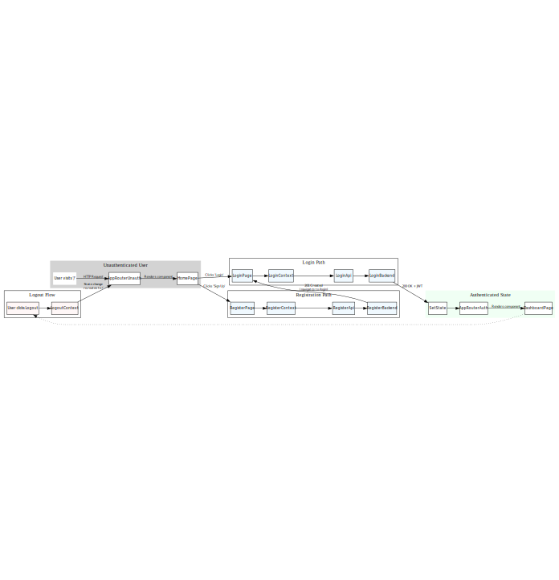

# SportSphere Frontend (Client)

This directory contains the complete frontend application for SportSphere, built using React and Vite.

---

## Core Technologies

| Technology        | Description                 |
|-------------------|-----------------------------|
| **Framework**     | React 18                    |
| **Language**      | TypeScript                 |
| **Build Tool**    | Vite                       |
| **Styling**       | Tailwind CSS               |
| **Routing**       | React Router DOM v6        |
| **State Management** | React Context API         |
| **Testing**       | Vitest & React Testing Library |

---

## How to Run This Application

This application is part of a full-stack, containerized project and is **not intended to be run standalone**.

The entire stack (frontend, backend, database) must be started from the root directory of the `SportSphere_new` project:

```bash
## From the root directory, build and start all services
docker-compose up --build
```

The frontend will be accessible at [http://localhost:5173](http://localhost:5173).

---

### Running Standalone (for specific testing only)

If you need to run the frontend server independently (and the backend is already running), you can do so from within this client directory:

```bash
## 1. Install dependencies
npm install

## 2. Run the Vite development server
npm run dev
```

---

## Project Architecture

The frontend is built on four main architectural principles:

- **Component-Based UI:** Pages are composed of smaller, reusable components.
- **Centralized State Management:** Global state (like authentication) is managed in a React Context, not passed down as props ("prop drilling").
- **Abstracted API Layer:** All fetch calls are handled in a dedicated "service" layer, separating data logic from UI logic.
- **Client-Side Routing:** `react-router-dom` is used to create a true multi-page experience with unique URLs and browser history support.

---

## Folder Structure

```
/src/components    # Reusable, UI components (e.g., Layout.tsx, Button.tsx)
/src/context       # Global state managers (e.g., AuthContext.tsx)
/src/pages         # Components that represent a full page (e.g., LoginPage.tsx, DashboardPage.tsx)
/src/services      # The API abstraction layer (api.ts), which is the only part of the app that makes fetch requests
/src/tests         # Frontend unit and integration tests
/src/types         # Shared TypeScript interfaces for the frontend (e.g., User, AuthResponse)
App.tsx            # The main application component, responsible for defining the routes
main.tsx           # The entry point that renders the React app and provides the global AuthProvider
```

---

## Data Flow: User Authentication

This diagram shows the end-to-end flow for a user logging in, from clicking the button to seeing the dashboard.



---

## Key Concepts

### State Management (`src/context/AuthContext.tsx`)

All global authentication state is managed here. This file provides the `AuthProvider` component and the `useAuth` hook.

- **AuthProvider:** This component wraps the entire application in `main.tsx`. It is responsible for holding the `user` and `isAuthenticated` state and contains the `login`, `register`, and `logout` functions that modify this state.
- **useAuth():** This is the custom hook that components must use to access the authentication state or functions. Any component that calls `useAuth()` will automatically re-render if the authentication state changes.

---

### Routing (`src/App.tsx`)

This file is the central router for the application. It uses `react-router-dom` to map URL paths to specific page components.

- `<Routes>`: Defines all routes.
- `<PublicRoute>`: A custom wrapper for pages like Login and Home. It checks the auth state: if the user is already logged in, it redirects them to the dashboard.
- `<ProtectedRoute>`: A custom wrapper for private pages like the Dashboard. It checks the auth state: if the user is not logged in, it redirects them to the login page.

---

### API Service Layer (`src/services/api.ts`)

This is the only file in the frontend that is allowed to make network requests.

- It exports a function for each API endpoint (e.g., `apiLogin`, `apiRegister`).
- It contains a generic request helper function that:
  - Prepends the `/api` prefix (which Vite proxies).
  - Automatically attaches the `Authorization: Bearer <token>` header if a token exists in `localStorage`.
  - Centralizes error handling by parsing the JSON error message from the backend and throwing a new `Error`.
- Components and the `AuthContext` must use these service functions instead of `fetch` directly.
